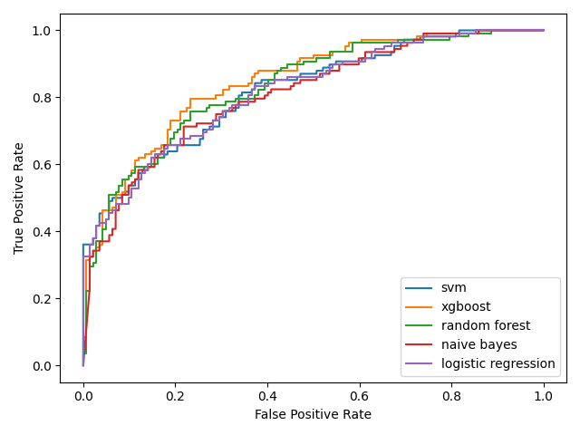

# [社交媒体舆论场虚假账号检测](http://www.crowdhmt.com/crowdcompetition/settings)

- [社交媒体舆论场虚假账号检测](#社交媒体舆论场虚假账号检测)
  - [Highlights](#highlights)
  - [实验环境](#实验环境)
  - [仓库目录结构](#仓库目录结构)
  - [任务介绍](#任务介绍)
  - [特征工程与可视化](#特征工程与可视化)
    - [安装依赖](#安装依赖)
    - [数据预处理](#数据预处理)
    - [数据可视化](#数据可视化)
  - [算法对比](#算法对比)
  - [XGBoost可视化](#xgboost可视化)
  - [预测测试集结果](#预测测试集结果)
  - [Acknowledgement](#acknowledgement)

## Highlights

- 利用**决策树对连续数据进行最优分箱**，减少异常值对模型的影响，提高模型泛化能力；
- 通过人工和**基于遗传算法的符号推理生成高质量特征**，挖掘大量数据集中隐藏的非线性关系，提高模型对复杂关系的建模能力；
- 利用**递归特征消除的方法过滤冗余特征和不重要特征**，降低模型复杂度，提高训练和推理效率；
- 对比常见的机器学习分类器算法，选用**XGBoost分类器**，并在此基础上使用**网格搜索的方式进一步调优**，充分发挥模型性能。

最终，我们在测试集上达到了**0.8248**的F1 Score，排名[第三](http://www.crowdhmt.com/crowdcompetition/leaderboard)。

## 实验环境

- Linux version 4.15.0-197-generic 
- Python 3.9.16
- Intel(R) Xeon(R) CPU E5-2690 v4 @ 2.60GHz

**注意：由于代码中存在很多随机算法，即使我们固定了随机种子，最终的结果也可能因为运行环境和硬件平台不同而产生轻微差异。**

## 仓库目录结构

```
.
├── README.md           # 本文件
├── algorithm/          # 所有机器学习算法
├── data/               # 原始数据
├── data_process.py     # 数据预处理脚本
├── dev/                # 开发过程的可视化代码
├── figs/               # 图片目录
├── predict.py          # 最终的模型方案
├── requirements.txt    # 依赖包
├── test_label.json     # predict.py的输出结果
└── visualization.py    # 数据可视化脚本
```

## 任务介绍

该赛题是一个典型的二分类问题，给定账户的一系列特征，预测其是否为虚假账号。数据集由2484条账户信息构成，账户信息来自于知名社交媒体平台Twitter：

| 类别           | 训练集 | 验证集 | 测试集 | 总计  |
| -------------- | ------ | ------ | ------ | ----- |
| 真实人类       | 1130   | 142    | 141    | 1413  |
| 虚假机器人     | 856    | 108    | 107    | 1071  |

每个用户有42个特征和1个标签，每个特征的具体信息如下：
- `id`: 用户的唯一标识符。
- `id_str`: 用户ID的字符串表示。
- `name`: 用户的显示名称，通常是用户的姓名或用户名。
- `screen_name`: 用户的屏幕名称，是用户在 Twitter 上的唯一用户名。
- `location`: 用户填写的位置信息，表示用户所在地。
- `description`: 用户的个人描述，通常包含一些关于用户的简短信息。
- `url`: 用户的网站链接，如果用户提供了的话。我们将其转化为Boolean型变量，1表示提供了url；0表示没有提供url。
- `entities`: 包含用户描述及网站链接的实体信息。由于这一信息是上面`url`和`description`中url的合集。
- `protected`: 表示用户是否设置了账号的隐私保护。
- `followers_count`: 用户的关注者数量，即关注该用户的人数。
- `friends_count`: 用户的关注数量，即用户关注的其他用户数。
- `listed_count`: 用户被其他用户列入列表的次数，通常表示用户在社交媒体上的受欢迎程度。
- `created_at`: 用户账号创建时间，表示账号是在哪一天和时间创建的。
- `favourites_count`: 用户标记为喜欢（或收藏）的推文或帖子的数量。
- `utc_offset`: 用户的时区偏移量。
- `time_zone`: 用户所在的时区。
- `geo_enabled`: 用户是否启用地理位置信息。
- `verified`: 用户是否经过验证，即是否为认证账号。
- `statuses_count`: 用户发布的推文或帖子的总数量。
- `lang`: 用户账号的语言设置。
- `contributors_enabled`: 用户是否启用了贡献者功能。
- `is_translator`: 用户是否是翻译员。
- `is_translation_enabled`: 用户是否启用了翻译功能。
- `profile_background_color`: 用户的个人资料背景颜色。
- `profile_background_image_url`: 用户的个人资料背景图片URL。
- `profile_background_image_url_https`: 用户的个人资料背景图片URL(安全链接)。
- `profile_image_url`: 用户的个人资料图片URL。
- `profile_image_url_https`: 用户的个人资料图片URL(安全链接)。
- `profile_banner_url`: 用户的个人资料横幅图片URL。
- `profile_link_color`: 用户的个人资料链接颜色。
- `profile_sidebar_border_color`: 用户的个人资料侧边栏边框颜色。
- `profile_sidebar_fill_color`: 用户的个人资料侧边栏填充颜色。
- `profile_text_color`: 用户的个人资料文本颜色。
- `profile_use_background_image`: 用户是否使用个人资料背景图片。
- `has_extended_profile`: 用户是否启用了扩展个人资料。
- `default_profile`: 用户是否使用默认个人资料。
- `default_profile_image`: 用户是否使用默认个人资料图片。
- `following`: 当前用户是否正在关注该用户。
- `follow_request_sent`: 当前用户是否发送了关注请求给该用户。
- `notifications`: 当前用户是否接收通知。
- `translator_type`: 用户类型，是否为翻译员。

## 特征工程与可视化

### 安装依赖

```bash
pip install -r requirements.txt
```

### 数据预处理

```bash
python data_process.py
```

上面的代码将依次进行无用特征删除、字符串和布尔型数据处理、对数预处理、特征挖掘、特征过滤等特征工程处理方法，最终得到32个特征：
- `name_fuzz_ratio`: name与screen_name的相似度, 分箱为0-4
- `description_length`: 用户的个人描述的长度
- `description_polarity`: 用户的个人描述的正负面性
- `description_subjectivity`: 用户的个人描述的主客观性
- `description_url_number`: 用户的个人描述中含有的url数目
- `url`: 用户是否提供网站链接, 非空为1，否则为0
- `followers_count`: 关注该用户的人数
- `friends_count`: 用户关注的其他用户数
- `listed_count`: 用户被其他用户列入列表的次数
- `created_at_week`: 用户账号创建时间所在星期
- `created_at_hour`: 用户账号创建时间所在小时
- `favourites_count`: 用户标记为喜欢的推文数量
- `geo_enabled`: 用户是否启用地理位置信息
- `verified`: 是否为认证账号
- `statuses_count`: 用户发布的推文总数量
- `lang`: 用户账号的语言设置, 分箱为0-17
- `profile_background_image_url`: 用户的个人资料背景图片
- `profile_background_tile`: 用户的个人资料背景是否平铺
- `profile_use_background_image`: 用户是否使用个人资料背景图片
- `has_extended_profile`: 用户是否启用了扩展个人资料
- `default_profile`: 用户是否使用默认个人资料
- `translator_type`: 用户类型(是否为翻译员)
- `mined_feature_[0-9]`: SymbolicTransformer挖掘出的10个特征

### 数据可视化

```bash
python draw_distribution.py
```

SymbolicTransformer挖掘出的10个特征中我们只取前三个，剩余的25个特征的分布如下图所示：

<div align=center>

</div>
</br>

箱线图：

<div align=center>

</div>
</br>

相关性矩阵与t-SNE降维：

<div align=center>


</div>
</br>

## 算法对比

我们对比了常见的6种[机器学习算法](./algorithm/)，结果如下：

| 算法             | 训练集F1-score | 验证集F1-score |
| ---------------- | -------------- | -------------- |
| 支持向量机       | 0.7652         | 0.7309         |
| 朴素贝叶斯       | 0.7318         | 0.7222         |
| 随机森林         | 0.8458         | 0.7332         |
| 逻辑回归         | 0.7680         | 0.7284         |
| 多层感知机       | 0.7537         | 0.7320         |
| XGBoost          | *0.9273*       | *0.7371*       |

它们的ROC曲线如下(绘制代码见[此](./dev/draw_roc_curve.py))：

<div align=center>


</div>
</br>

可以看出**XGBoost**方法表现最好。

## XGBoost可视化

我们使用XGBoost的`plot_importance`方法可视化特征重要性：

<div align=center>


</div>
</br>

使用`plot_tree`方法可视化决策树，其中第1、10、100、1000棵Boosting树如下：

<div align=center>


</div>
</br>

## 预测测试集结果

```bash
python predict.py
```

你将会得到一个`test_label.json`文件。

## Acknowledgement

感谢[@xwy-bit](https://github.com/xwy-bit)、[@weizhang-ustc](https://github.com/weizhang-ustc)、[@pipixia244](https://github.com/pipixia244)的辛勤付出。